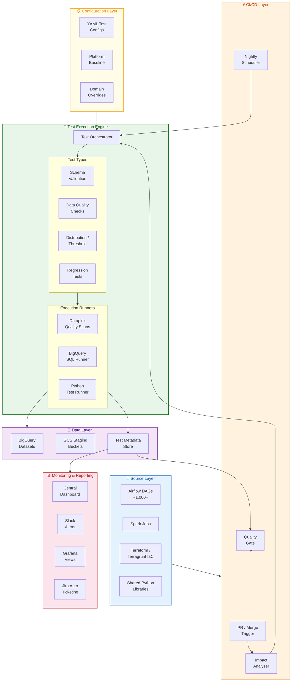
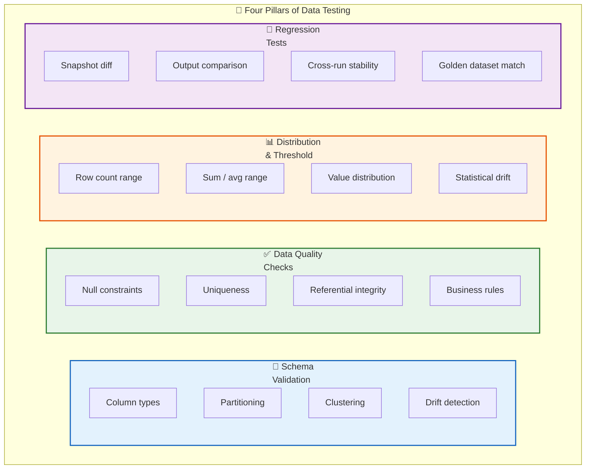
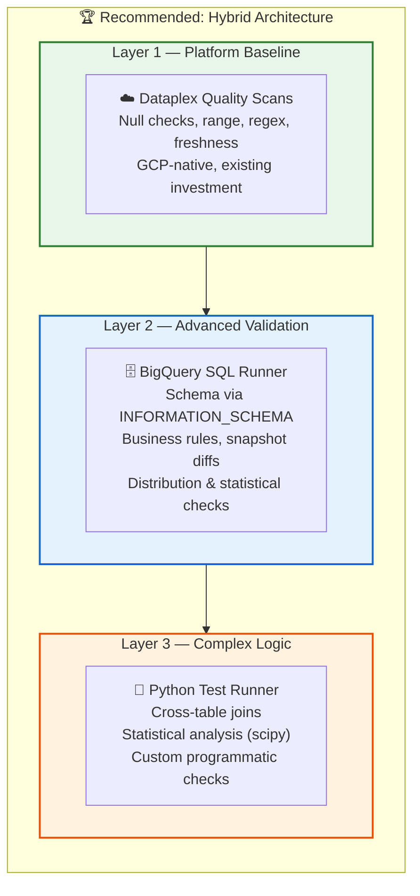
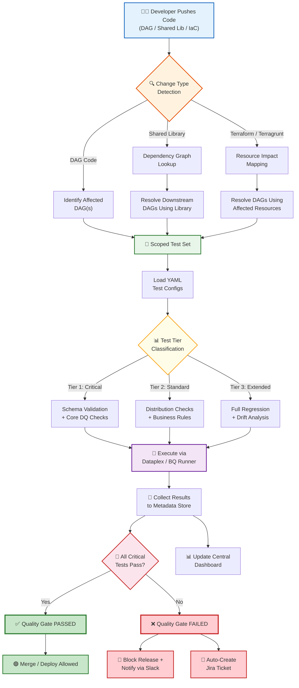
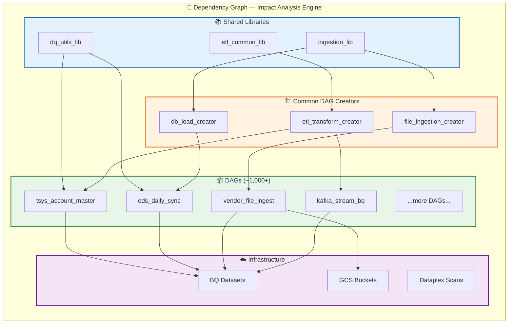
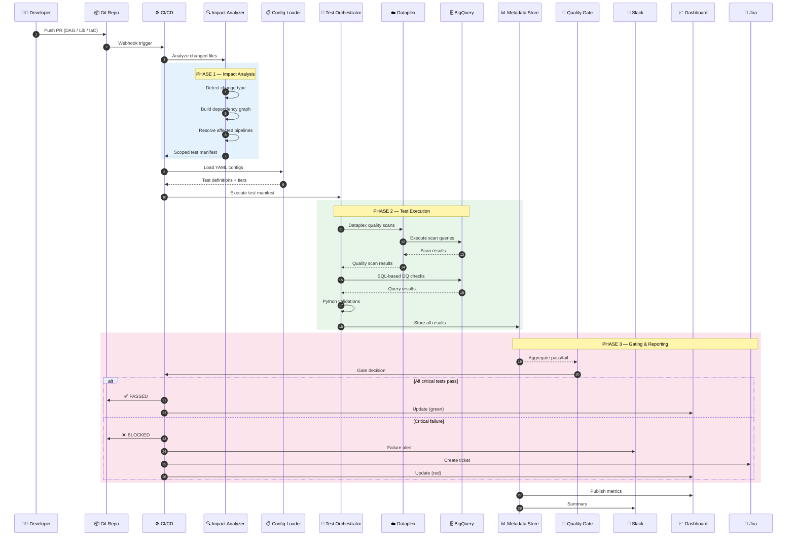
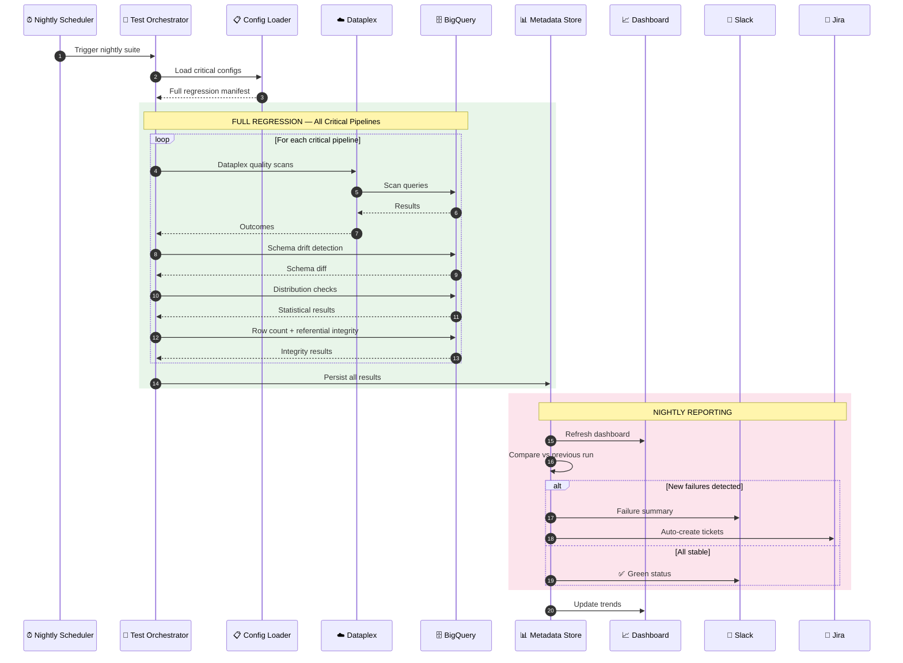

<div align="center">

# Terminus Data Quality & Regression Testing Framework

### High-Level Design & Architecture

---

**PCBDF-2899** | **PCBDF-3032** | **PCBINIT-1799**

**PCB: Data Foundation**

---

| | |
|:---|:---|
| **Document** | Architecture Design — CTO Review |
| **Version** | 1.0 |
| **Date** | March 27, 2026 |
| **Author** | Harshit Patel |
| **Status** | Draft for Review |
| **Classification** | Internal — Engineering Leadership |

</div>

---

<br/>

## SLIDE 1 — Executive Summary

<br/>

### The Challenge

The Terminus Data Platform runs **~1,000+ Airflow DAGs** across BigQuery, GCS, Dataproc, and Cloud Functions. Today, there is **no automated way** to validate data quality or detect regressions when code changes. Any modification to shared libraries requires **manual testing across hundreds of dependent pipelines** — a process that is slow, error-prone, and does not scale.

### The Solution

A **platform-native, automated data quality and regression testing framework** that:

> **Validates** data quality continuously across every critical pipeline
>
> **Detects** regressions automatically when shared code, pipeline logic, or infrastructure changes
>
> **Gates** deployments in CI/CD — no bad data reaches production
>
> **Scales** intelligently — tests only what's affected, not all 1,000+ DAGs
>
> **Reports** quality metrics via dashboards, Slack alerts, and Grafana

### Impact at a Glance

| Metric | Today | With Framework |
|:-------|:-----:|:--------------:|
| Regression detection | **Manual** — days | **Automated** — minutes |
| Automated test coverage (critical pipelines) | **~0%** | **100%** |
| Time to validate shared library change | **Days** | **Minutes** |
| CI/CD quality gate | **None** | **Blocking on critical failures** |
| Data quality visibility | **Per-pipeline logs** | **Centralized dashboard** |
| Manual regression effort | **~40 engineer-hrs/change** | **<1 hour (review only)** |

---

<br/>

## SLIDE 2 — Why This Matters

<br/>

### The Business Case

```
┌─────────────────────────────────────────────────────────────────────┐
│                                                                     │
│   🔴 RISK          Data corruption goes undetected until            │
│                     downstream consumers report issues              │
│                                                                     │
│   ⏱️ VELOCITY       Shared library changes require days of          │
│                     manual regression before merging                 │
│                                                                     │
│   💰 COST           Senior engineers spend 30-40% of time           │
│                     on manual data validation                       │
│                                                                     │
│   📊 COMPLIANCE     No auditable quality guarantees for             │
│                     financial data pipelines                        │
│                                                                     │
│   🔄 SCALE          1,000+ DAGs and growing — manual                │
│                     approach cannot keep up                         │
│                                                                     │
└─────────────────────────────────────────────────────────────────────┘
```

### Strategic Alignment

This framework directly supports the **Terminus Data Platform Strategy** roadmap:

- **Section 2.3** — "Data with quality" → Platform-level quality monitoring
- **Section 2.4.2** — "Regression testing" → Automated/AI-powered solutions
- **Section 2.5** — "Observable platform" → Pipeline-level monitoring and SLAs
- **Work Items Matrix** — Addresses "Dataplex quality scan", "automated regression testing", and "enhance quality check within data pipelines"

---

<br/>

## SLIDE 3 — Design Principles

<br/>

We designed this framework around **seven core principles** that ensure long-term success:

| # | Principle | What It Means |
|:-:|:----------|:--------------|
| **1** | **Platform-First** | The framework provides a common baseline for ALL teams. Not a one-off tool for one domain. |
| **2** | **Configuration-as-Code** | All tests are YAML files in the repo — versioned, reviewable, and auditable alongside pipeline code. |
| **3** | **Build on Existing Investment** | We extend Dataplex quality scans, existing Airflow patterns, and current Slack/Grafana stack. No new tooling. |
| **4** | **Smart Scoping** | Impact analysis ensures we test only what's affected. A shared lib change tests 47 DAGs, not 1,000+. |
| **5** | **Fail Fast, Fail Clearly** | Critical failures block deployments immediately with actionable error messages. No silent data corruption. |
| **6** | **Incremental Adoption** | Teams start with free platform baseline tests. Add domain-specific checks at their own pace. |
| **7** | **Security by Default** | Tests never touch raw PII. Use obfuscated datasets for regression. RBAC enforced at every layer. |

---

<br/>

## SLIDE 4 — High-Level Architecture

<br/>

The framework consists of **six logical layers**, each with a clear responsibility:



### Layer Responsibilities

| Layer | Purpose | Key Components |
|:------|:--------|:---------------|
| **🔧 Source** | Code artifacts that trigger tests | Airflow DAGs, Spark Jobs, Terraform/Terragrunt, Shared Python Libraries |
| **⚡ CI/CD** | Trigger, schedule, and gate | PR/Merge Webhooks, Impact Analyzer, Nightly Scheduler, Quality Gate |
| **🧪 Test Engine** | Execute all test types | Test Orchestrator, Dataplex Scanner, BQ SQL Runner, Python Runner |
| **📋 Configuration** | Define what tests run | YAML test configs, Platform baseline rules, Domain overrides |
| **💾 Data** | Data under test + results | BigQuery datasets, GCS staging, Test metadata store |
| **📊 Reporting** | Visibility and alerting | Central Dashboard, Slack, Grafana, Jira auto-ticketing |

---

<br/>

## SLIDE 5 — Four Pillars of Data Testing

<br/>

The framework supports **four distinct test types**, each addressing a different dimension of data reliability:



### Test Types — Detail

| Pillar | What It Validates | Example | When It Runs |
|:-------|:------------------|:--------|:-------------|
| **📐 Schema** | Table structure matches expected definition — columns, types, partitioning, clustering | "Column `account_id` must be `INT64`, table partitioned by `load_date`" | Every PR, every merge |
| **✅ Quality** | Data integrity — nulls, duplicates, referential integrity, business logic | "`account_close_date` must not precede `account_open_date`" | Every PR, every merge |
| **📊 Distribution** | Statistical health — row counts, sums, value ranges, drift from baseline | "Daily row count within ±20% of 30-day average" | Nightly + merge |
| **🔄 Regression** | Output stability — results match golden snapshot after code change | "Output table hash matches golden snapshot after shared lib update" | When shared code changes |

### Test Tiering — What Blocks What

| Tier | Criticality | CI/CD Behavior | Examples |
|:----:|:------------|:---------------|:---------|
| **Tier 1** | 🔴 Critical | **Blocks merge/deploy** | Null primary keys, schema mismatch, regression failure |
| **Tier 2** | 🟡 Standard | **Warning** — review recommended | Row count deviation, enum value violation |
| **Tier 3** | 🟢 Extended | **Informational** — non-blocking | Statistical drift, distribution anomalies |

---

<br/>

## SLIDE 6 — Tooling Recommendation

<br/>

We evaluated three architecture options. Our recommendation is the **Hybrid Approach**.

### Options Compared

| Criteria | Option A: Dataplex Only | Option B: Great Expectations | **Option C: Hybrid** ✅ |
|:---------|:---:|:---:|:---:|
| GCP Native | ✅ Fully native | ❌ External OSS | ✅ Primarily native |
| Existing Investment | ✅ Extends Dataplex | ❌ New tool | ✅ Builds on current |
| Schema Validation | ⚠️ Basic | ✅ Strong | ✅ Strong |
| Custom SQL Checks | ⚠️ Limited | ✅ Full | ✅ Full |
| Regression Testing | ❌ Not supported | ⚠️ Custom work | ✅ Native BQ diffs |
| Impact Analysis | ❌ None | ❌ None | ✅ Custom engine |
| Learning Curve | 🟢 Low | 🟡 Medium | 🟢 Low |
| Operational Cost | 🟢 Managed | 🔴 Self-managed | 🟢 Managed |
| PII / Security | ✅ IAM native | ⚠️ Needs config | ✅ IAM native |

### Recommended: Three-Layer Hybrid Execution



**Why Hybrid?**

- **Layer 1 (Dataplex)** — We already use Dataplex. Get baseline quality scans with zero new infrastructure.
- **Layer 2 (BigQuery SQL)** — BigQuery is our primary data store. Run schema checks and business rules without moving data.
- **Layer 3 (Python)** — For complex logic that needs programmatic control. Published as a package to JFrog.
- **No new external frameworks** — Zero additional operational overhead. Everything runs on GCP services we already manage.

---

<br/>

## SLIDE 7 — CI/CD Integration & Quality Gate

<br/>

The framework integrates directly into the existing Terminus CI/CD pipeline. Tests are triggered automatically and gate deployments.

### End-to-End Flow



### Trigger Model

| Trigger | When | What Gets Tested | Blocking? |
|:--------|:-----|:-----------------|:---------:|
| **PR Check** | Every PR opened/updated | Only affected pipelines (via impact analysis) | Tier 1 blocks |
| **Merge Gate** | Merge to `main`/`master` | Affected pipelines + direct dependents | Tier 1 blocks |
| **Nightly Regression** | 2:00 AM UTC daily | All critical pipelines (full suite) | Alerts only |
| **Post-Deploy PIV** | After production release | Deployed pipeline targets | Alerts only |
| **Manual / Ad-hoc** | On-demand via CLI | User-specified scope | User-specified |

### Quality Gate Decision Matrix

| Tier 1 | Tier 2 | Tier 3 | Decision |
|:------:|:------:|:------:|:---------|
| ✅ Pass | ✅ Pass | ✅ Pass | **✅ PASS** — Deploy allowed |
| ✅ Pass | ✅ Pass | ❌ Fail | **✅ PASS** + non-blocking alert |
| ✅ Pass | ❌ Fail | Any | **⚠️ PASS** + review recommended |
| ❌ Fail | Any | Any | **❌ BLOCKED** — Cannot merge/deploy |

---

<br/>

## SLIDE 8 — Impact Analysis Engine

<br/>

The core innovation of this framework. When a shared library changes, we do **NOT** run all 1,000+ DAG tests. Instead, we determine the **minimum affected scope** using a dependency graph.

### The Dependency Graph



### How It Works

**Step 1 — Detect Change Type**

| Change Type | Detection Method | Example |
|:------------|:-----------------|:--------|
| DAG code | File path matching (`dags/*/`) | `dags/tsys/tsys_account_master_dag.py` |
| Shared library | File path matching (`shared_libs/*/`) | `shared_libs/etl_common/transforms.py` |
| Terraform/IaC | File path matching (`infra/*/`) | `infra/modules/bigquery/main.tf` |

**Step 2 — Resolve Affected Scope**

```
IF change is DAG code:
    → Test that specific DAG only

IF change is shared library:
    → Query dependency graph: Library → DAG Creators → DAGs
    → Example: etl_common_lib change → 47 DAGs across 5 domains

IF change is Terraform/IaC:
    → Map resource → consuming DAGs
    → Example: BQ dataset change → 12 DAGs using that dataset
```

**Step 3 — Result**

> Instead of testing **1,000+ DAGs** on every shared lib change,
> impact analysis scopes it to **only the ~47 affected DAGs**.
>
> **95%+ reduction** in unnecessary test execution.

### Graph Maintenance

| Method | Purpose | Frequency |
|:-------|:--------|:----------|
| **Static import analysis** | Parse Python imports in DAG files | Every PR (incremental) |
| **DAG creator mapping** | Map creators to generated DAGs | Every PR (incremental) |
| **Terraform resource mapping** | Map `.tf` resources to consuming DAGs | Every PR (incremental) |
| **Full graph rebuild** | Catch drift, validate consistency | Nightly |

---

<br/>

## SLIDE 9 — Test Declaration Standard

<br/>

Tests are defined as **YAML configuration files** stored alongside pipeline code in the repository.

### Repository Structure

```
repo-root/
│
├── dags/
│   ├── tsys/
│   │   ├── tsys_account_master_dag.py          ← Pipeline code
│   │   └── tests/
│   │       └── tsys_account_master.dq.yaml     ← Test config
│   ├── ods/
│   │   ├── ods_daily_sync_dag.py
│   │   └── tests/
│   │       └── ods_daily_sync.dq.yaml
│   └── ...
│
├── shared_libs/
│   └── etl_common/
│       └── tests/
│           └── etl_common_regression.dq.yaml   ← Shared lib tests
│
├── platform_baseline/
│   ├── baseline_schema.dq.yaml                 ← Platform rules
│   ├── baseline_quality.dq.yaml                  (inherited by all)
│   └── baseline_distribution.dq.yaml
│
└── dq_framework_config.yaml                    ← Global settings
```

### Example: YAML Test Configuration

```yaml
# tsys_account_master.dq.yaml
---
version: "1.0"
metadata:
  pipeline_id: "tsys_account_master"
  domain: "tsys"
  owner: "tsys-outcome-team"

target:
  project: "terminus-prod"
  dataset: "tsys_raw"
  table: "account_master"

inherit_baseline: true          # ← Get platform baseline tests for free

tests:

  # Schema Validation (Tier 1 — blocks deployment)
  - id: "schema_001"
    type: "schema"
    tier: 1
    name: "Schema matches expected definition"
    expect:
      columns:
        - { name: "account_id",    type: "INT64",   nullable: false }
        - { name: "customer_id",   type: "INT64",   nullable: false }
        - { name: "account_status", type: "STRING",  nullable: false }
        - { name: "current_balance", type: "NUMERIC", nullable: false }
      partitioning: { field: "load_date", type: "DAY" }

  # Data Quality (Tier 1 — blocks deployment)
  - id: "dq_001"
    type: "quality"
    tier: 1
    name: "Business rule — close date after open date"
    check: "sql_assertion"
    sql: |
      SELECT COUNT(*) as violations
      FROM `{project}.{dataset}.{table}`
      WHERE account_close_date < account_open_date
    expect: { violations: 0 }

  # Distribution (Tier 2 — warning)
  - id: "dist_001"
    type: "distribution"
    tier: 2
    name: "Row count within expected range"
    check: "row_count_range"
    reference: "trailing_30d_avg"
    tolerance_pct: 20

  # Regression (Tier 1 — blocks deployment)
  - id: "reg_001"
    type: "regression"
    tier: 1
    name: "Output matches golden snapshot"
    check: "snapshot_diff"
    golden_table: "account_master_golden"
    max_diff_rows_pct: 0
```

### Platform Baseline — Free Quality for Every Team

Every dataset automatically inherits these checks (zero configuration by outcome teams):

| Baseline Rule | What It Checks | Tier |
|:-------------|:---------------|:----:|
| Schema drift detection | Columns added/removed/type-changed vs. registered schema | **1** |
| Table not empty | Pipeline output must contain at least 1 row | **1** |
| Standard metadata columns | `_load_timestamp` and `_loader_id` must exist | **1** |
| Data freshness | Data age must be within SLA (default: 26 hours) | **2** |

Teams can **override** baseline thresholds per-domain without disabling the baseline:

```yaml
inherit_baseline: true
baseline_overrides:
  - rule_id: "baseline_freshness"
    max_age_hours: 48              # This domain has a longer SLA
```

---

<br/>

## SLIDE 10 — Sequence Diagram: PR-Triggered Execution

<br/>

This diagram shows the complete lifecycle of a test run triggered by a PR:



---

<br/>

## SLIDE 11 — Sequence Diagram: Nightly Regression Suite

<br/>

The nightly suite runs **full regression** across all critical pipelines — catching issues that individual PR tests might miss:



### PR vs. Nightly — Comparison

| Aspect | PR-Triggered | Nightly Regression |
|:-------|:-------------|:-------------------|
| **Scope** | Only affected pipelines (via impact analysis) | All critical pipelines |
| **Test Tiers** | Tier 1 + Tier 2 | Tier 1 + Tier 2 + Tier 3 |
| **Blocking** | Yes (Tier 1 blocks merge) | No (alerts and tickets) |
| **Purpose** | Catch regressions before they merge | Catch data drift, environment issues, upstream changes |
| **Frequency** | Every PR/push | Daily at 2:00 AM UTC |

---

<br/>

## SLIDE 12 — Monitoring, Reporting & Alerting

<br/>

### Central Dashboard (Looker Studio / Data Studio)

Powered by the `terminus_dq_metadata` BigQuery dataset:

| Dashboard View | What It Shows |
|:---------------|:-------------|
| **Executive Summary** | Overall quality score, pass/fail trend line, coverage % |
| **Domain View** | Quality by domain (TSYS, ODS, Vendor, etc.) with drill-down |
| **Pipeline View** | Per-DAG test status, last run, failure history, SLA compliance |
| **Test Type View** | Schema vs. Quality vs. Distribution vs. Regression pass rates |
| **Failure Drill-Down** | Failed test details — expected vs. actual, SQL output, remediation hints |
| **Coverage Map** | % of pipelines with test configs, % of tables under monitoring |

### Alerting Strategy

| Channel | When | What |
|:--------|:-----|:-----|
| **Slack → CI channel** | PR test failure | Pipeline name, failed tests, link to CI run |
| **Slack → Domain channel** | Nightly failure for domain | Domain summary, new vs. recurring failures |
| **Slack → Platform channel** | Platform baseline failure | Cross-domain alert with impact assessment |
| **Grafana** | Continuous | Quality score trends, test latency, failure rates |
| **Jira** | 3+ consecutive nightly failures | Auto-ticket with failure details, assigned to domain owner |

### Metadata Store Schema

All test results are stored in BigQuery for full auditability:

```
terminus_dq_metadata/
├── test_runs              ← One row per execution run
├── test_results           ← One row per individual test
├── test_configs_audit     ← Changelog of config changes
├── quality_metrics        ← Aggregated scores by domain
└── dependency_graph       ← Pipeline dependency mappings
```

---

<br/>

## SLIDE 13 — End-to-End Example

<br/>

### Scenario

> A developer modifies the `transform_dates()` function in `shared_libs/etl_common/transforms.py`.
>
> This function is used by **47 DAGs** across **5 domains**.

### What Happens — Step by Step

| Step | What Happens | Result |
|:----:|:-------------|:-------|
| **1** | Developer pushes PR with change to `etl_common/transforms.py` | PR created |
| **2** | CI pipeline triggered via webhook | Pipeline starts |
| **3** | Impact Analyzer detects: change in `etl_common_lib` | Change type: Shared Library |
| **4** | Dependency graph queried → resolves **47 affected DAGs** across 5 domains | Scoped test set built |
| **5** | YAML configs loaded for all 47 pipelines + platform baseline | **190 total tests** identified |
| **6** | Dataplex runs baseline quality scans on 47 target tables | Scans complete |
| **7** | BQ SQL Runner executes schema checks, business rules, snapshot diffs | SQL results collected |
| **8** | All results written to `terminus_dq_metadata.test_results` | 190 results stored |
| **9** | Quality Gate aggregates: **188 passed, 2 failed** (Tier 1 — date regression in TSYS) | **Gate: ❌ FAIL** |
| **10** | PR status set to ❌, merge blocked | Developer notified |
| **11** | Slack alert sent to `#tsys-data-quality` with failure details | Team aware |
| **12** | Developer fixes `transform_dates()`, pushes update | New commit |
| **13** | Re-run: **190/190 pass** → Gate: ✅ PASS | **Merge allowed** |

### Key Insight

> Without impact analysis: **1,000+ DAG tests** would run (expensive, slow, noisy).
>
> With impact analysis: **Only 47 affected DAGs** tested — **95% reduction** in test scope.
>
> Without the framework: This regression would have **reached production undetected**.

---

<br/>

## SLIDE 14 — Security, Compliance & Data Handling

<br/>

| Concern | How We Handle It |
|:--------|:-----------------|
| **PII Protection** | Tests execute against tokenized/masked views. Raw PII tables accessed only via approved service accounts. |
| **RBAC** | GCP IAM roles consistent with existing Terminus RBAC. Test service account: `BigQuery Data Viewer` + `Dataplex DQ Scan Editor`. |
| **No PII in Logs** | Results store pass/fail and aggregate metrics only. SQL assertion results log violation **counts**, never raw data. |
| **Non-Prod Datasets** | Regression tests use obfuscated snapshots in a dedicated `terminus_dq_regression` dataset with restricted access. |
| **GCS Compliance** | No unencrypted data written to GCS. All test artifacts stored in BigQuery. |
| **Audit Trail** | Every test config change, execution, and result is logged in the metadata store with timestamps and commit SHAs. |

### Non-Production Dataset Strategy

```
terminus_dq_regression/
├── {table}_golden         ← Verified-correct output for comparison
├── {table}_sampled        ← 1% sample via BQ TABLESAMPLE (cost-efficient)
└── {table}_obfuscated     ← PII replaced with synthetic data
```

---

<br/>

## SLIDE 15 — Support Model & Ownership

<br/>

### Ownership Matrix

| Component | Owner | Responsibility |
|:----------|:------|:---------------|
| **DQ Framework Core** (orchestrator, runners, CLI) | Data Foundation Team | Build, maintain, and evolve the framework |
| **Platform Baseline Rules** | Data Foundation Team | Define and enforce platform-wide standards |
| **Domain Test Configs** (`.dq.yaml` files) | Outcome Teams | Author and maintain tests for their pipelines |
| **Impact Analysis Engine** | Data Foundation Team | Maintain dependency graph, resolve scoping |
| **Dashboard & Reporting** | Data Foundation Team | Build and maintain central dashboard |
| **CI/CD Integration** | Data Foundation + DevOps | Pipeline config, gate enforcement |

### Incident Escalation Model

| Tier | Scope | Who Investigates | Example |
|:----:|:------|:-----------------|:--------|
| **Tier 1** | Test failure on a specific pipeline | Outcome Team | "Is this a real data issue or a test config issue?" |
| **Tier 2** | Framework bug or false positive affecting multiple teams | Data Foundation Team | "Runner returning incorrect results for SQL assertions" |
| **Tier 3** | Platform outage (Dataplex, BigQuery, CI/CD) | Platform Engineering | "Dataplex API unavailable, all scans failing" |

### Jira Auto-Ticketing

When a test fails for **3+ consecutive nightly runs**, a Jira ticket is automatically created:

```
┌─────────────────────────────────────────────────────────┐
│  🎫 JIRA TICKET — Auto-Created                          │
│                                                         │
│  Title: [DQ] tsys_account_master — dq_003 failed 3x    │
│  Priority: High (Tier 1 test)                           │
│  Assignee: tsys-outcome-team                            │
│  Board: TSYS Sprint Board                               │
│                                                         │
│  Details:                                               │
│  • Test: "Close date must not precede open date"        │
│  • Consecutive failures: 3                              │
│  • Last pass: March 24, 2026                            │
│  • Violations found: 847 rows                           │
│  • Dashboard link: [View in Dashboard]                  │
│                                                         │
└─────────────────────────────────────────────────────────┘
```

---

<br/>

## SLIDE 16 — Phased Rollout Plan

```mermaid
graph TD
    subgraph P1["🟢 PHASE 1 — MVP Foundation"]
        direction LR
        P1A["YAML test<br/>declaration"]
        P1B["Dataplex scan<br/>integration"]
        P1C["Schema checks<br/>top-50 tables"]
        P1D["CI/CD quality<br/>gate"]
        P1E["Slack alerts"]
    end

    subgraph P2["🔵 PHASE 2 — Scale & Automation"]
        direction LR
        P2A["Impact analysis<br/>engine"]
        P2B["Dependency<br/>graph builder"]
        P2C["Nightly regression<br/>suite"]
        P2D["Central<br/>dashboard"]
        P2E["Team onboarding<br/>templates"]
    end

    subgraph P3["🟠 PHASE 3 — Platform Maturity"]
        direction LR
        P3A["1,000+ DAG<br/>coverage"]
        P3B["Grafana<br/>integration"]
        P3C["Jira auto-<br/>ticketing"]
        P3D["Non-prod safe<br/>datasets"]
        P3E["UAT/PIV<br/>automation"]
    end

    subgraph P4["🟣 PHASE 4 — AI-Powered Evolution"]
        direction LR
        P4A["AI test<br/>generation"]
        P4B["Anomaly<br/>detection"]
        P4C["Self-healing<br/>pipelines"]
        P4D["NL test<br/>authoring"]
    end

    P1 --> P2
    P2 --> P3
    P3 --> P4

    style P1 fill:#C8E6C9,stroke:#2E7D32,stroke-width:3px
    style P2 fill:#BBDEFB,stroke:#1565C0,stroke-width:3px
    style P3 fill:#FFE0B2,stroke:#E65100,stroke-width:3px
    style P4 fill:#E1BEE7,stroke:#6A1B9A,stroke-width:3px
```

<br/>



### Phase Detail

| Phase | What We Deliver | Success Criteria |
|:------|:----------------|:-----------------|
| **🟢 Phase 1 — MVP** | YAML test standard, Dataplex + BQ SQL runners, schema validation for top-50 tables, PR quality gate, Slack alerts | 50 critical tables automated; first blocked PR demo |
| **🔵 Phase 2 — Scale** | Impact analysis engine, dependency graph, nightly regression, central dashboard, onboarding templates | Impact analysis reduces scope by ≥80%; 200+ tables; dashboard live |
| **🟠 Phase 3 — Maturity** | Full 1,000+ DAG coverage, Grafana metrics, Jira auto-ticketing, non-prod datasets, UAT/PIV automation | 100% Tier-1 coverage; zero undetected production regressions |
| **🟣 Phase 4 — AI** | AI test generation from schema, anomaly detection, drift prediction, self-healing, NL authoring | 50% of new tests AI-generated; anomaly detection catches issues before humans |

---

<br/>

## SLIDE 17 — Framework CLI (Developer Experience)

<br/>

The framework ships as a Python CLI tool (`terminus-dq`) for local use and CI/CD integration:

```bash
# Run tests for a specific pipeline
$ terminus-dq run --pipeline tsys_account_master

# Run tests for all pipelines affected by changed files
$ terminus-dq run --impact-analysis --changed-files "shared_libs/etl_common/transforms.py"

# Run the full nightly regression suite
$ terminus-dq run --suite nightly --tier all

# Validate a YAML test config (syntax + schema check)
$ terminus-dq validate --config dags/tsys/tests/tsys_account_master.dq.yaml

# Rebuild the dependency graph
$ terminus-dq graph rebuild

# Show impact scope of a file change (dry-run)
$ terminus-dq graph impact --file "shared_libs/etl_common/transforms.py"
# Output: 47 DAGs affected across 5 domains (tsys: 12, ods: 8, vendor: 15, ...)
```

---

<br/>

## SLIDE 18 — Open Questions, Risks & Dependencies

<br/>

### Open Questions

| # | Question | Impact | Decision Needed From |
|:-:|:---------|:-------|:---------------------|
| 1 | Current state of Dataplex universal catalog rollout? | Phase 2 auto-discovery | Platform Team |
| 2 | Is BigQuery schema standardization approach finalized? | Phase 1 — schema source of truth | Data Foundation |
| 3 | Existing Terraform CI/CD pipeline structure? | Phase 2 — IaC impact analysis | DevOps |
| 4 | How are shared Python libs versioned / published to JFrog? | Phase 2 — dependency graph | Data Foundation |
| 5 | Appetite for incremental BQ compute cost from test queries? | All phases — budget | Finance / Platform |
| 6 | Streaming pipeline validation needed for MVP? | Phase 1 scoping | Architecture |

### Risks & Mitigations

| Risk | Severity | Mitigation |
|:-----|:--------:|:-----------|
| Dependency graph misses dynamic imports | 🔴 High | Combine static analysis + Airflow metadata + manual annotations |
| BQ cost escalation from test queries | 🟡 Medium | Use `TABLESAMPLE`, leverage Dataplex (included), monitor slot usage |
| Outcome team adoption resistance | 🟡 Medium | Auto-generate baseline tests, provide templates, show dashboard value |
| Alert fatigue from false positives | 🔴 High | Start with loose thresholds, tighten with data. Easy override mechanism. |
| Dataplex API rate limits or gaps | 🟡 Medium | Hybrid approach — BQ SQL Runner handles what Dataplex cannot |

### Dependencies

| Dependency | Current Status | Impact if Delayed |
|:-----------|:---------------|:------------------|
| Dataplex universal catalog | In progress | Auto-discovery deferred; manual test config required |
| BigQuery schema standardization | Planned | Schema tests use existing JSON/YAML definitions |
| Shared lib migration to JFrog | Planned | Dependency graph less precise |
| BQ tokenization/masking | In progress | Interim hash-based masking for non-prod datasets |

---

<br/>

## SLIDE 19 — Summary & Ask

<br/>

### What We've Designed

> A **platform-native, automated data quality and regression testing framework** that protects
> Terminus's ~1,000+ data pipelines from silent data corruption, reduces manual regression
> effort by 95%+, and provides CTO-level visibility into data quality across the organization.

### Key Architecture Decisions

| Decision | Rationale |
|:---------|:----------|
| **Hybrid execution** (Dataplex + BQ SQL + Python) | Leverages existing investment, no new tooling, GCP-native |
| **YAML config-as-code** | Version-controlled, reviewable, auditable |
| **Impact analysis engine** | Smart scoping — test 47 DAGs, not 1,000+ |
| **Three-tier test classification** | Critical tests block deploys; lower tiers inform |
| **Platform baseline + domain overrides** | Standardized quality floor with team flexibility |

### The Ask

- **Review and approve** the high-level architecture for detailed design phase
- **Align on Phase 1 scope** — top-50 critical tables for MVP
- **Confirm ownership** — Data Foundation Team as framework owners
- **Budget approval** for incremental BQ compute costs
- **Communicate to outcome teams** — what's coming and their role

---

<br/>

<div align="center">

### Thank You

**Terminus Data Quality & Regression Testing Framework**

*Building trust in data, one automated test at a time.*

---

Document ID: PCBDF-3032-HLD | Version 1.0 | March 27, 2026

Prepared by: Harshit Patel | PCB: Data Foundation

Epic: PCBDF-2899 | Initiative: PCBINIT-1799

</div>
