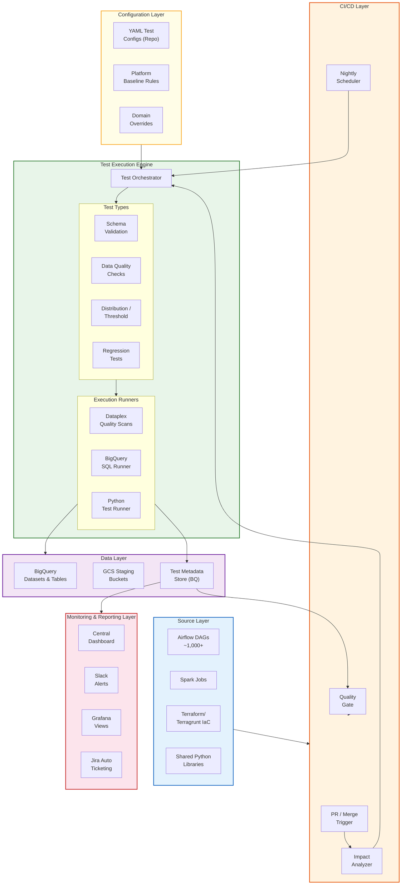
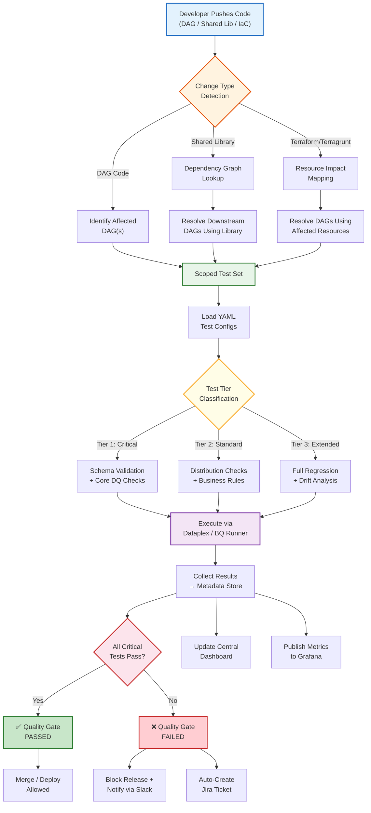
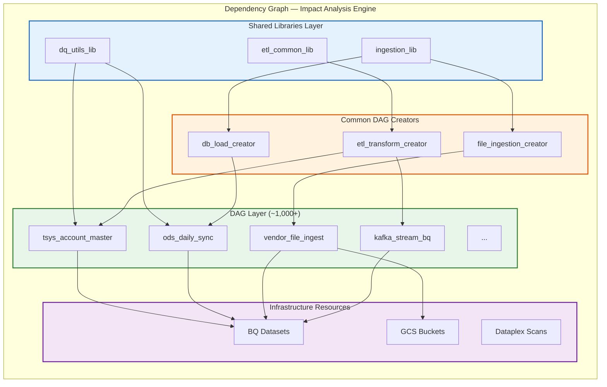
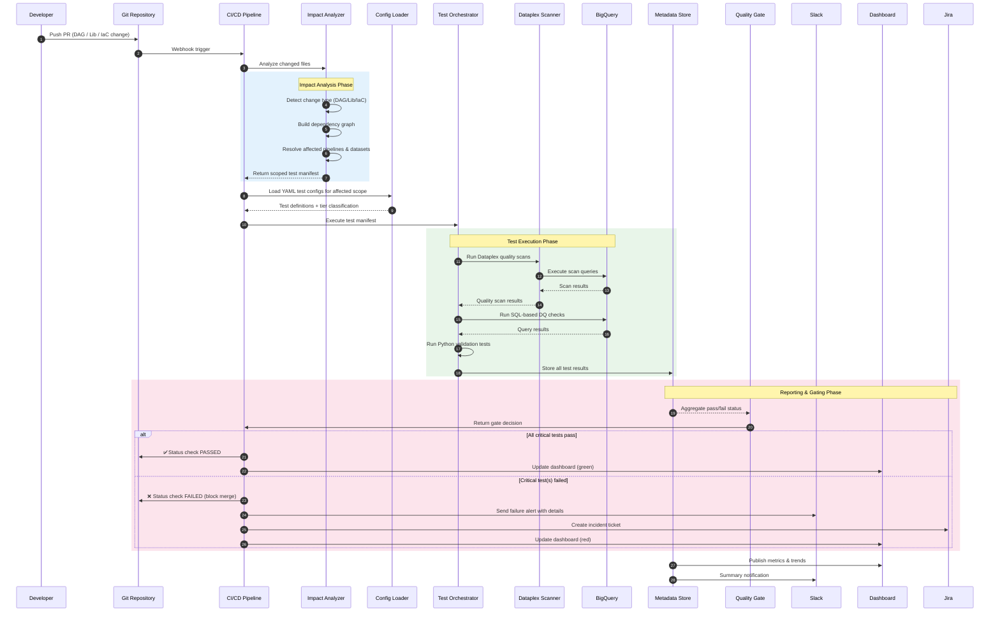
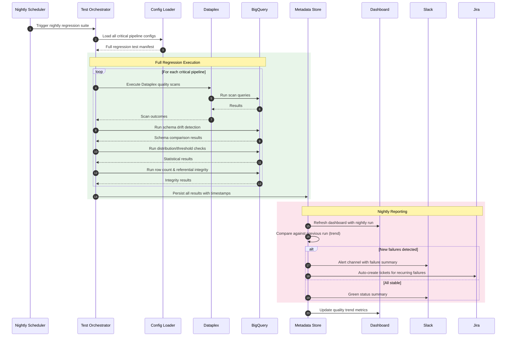

# Terminus Data Quality & Regression Testing Framework

## High-Level Design Document

| | |
|---|---|
| **Document ID** | PCBDF-3032-HLD |
| **Epic** | PCBDF-2899 — Build automated data quality & regression testing framework |
| **Parent Initiative** | PCBINIT-1799 — Continuous QA Data Environment |
| **Status** | Draft |
| **Author** | Harshit Patel |
| **Date** | March 27, 2026 |
| **Version** | 1.0 |
| **Classification** | Internal — Engineering Leadership |

---

## Table of Contents

1. [Executive Summary](#1-executive-summary)
2. [Problem Statement & Business Drivers](#2-problem-statement--business-drivers)
3. [Design Principles](#3-design-principles)
4. [High-Level Architecture](#4-high-level-architecture)
5. [Component Deep Dive](#5-component-deep-dive)
6. [Test Declaration Standard](#6-test-declaration-standard)
7. [CI/CD Integration & Quality Gate](#7-cicd-integration--quality-gate)
8. [Impact Analysis Engine](#8-impact-analysis-engine)
9. [Monitoring, Reporting & Alerting](#9-monitoring-reporting--alerting)
10. [Tooling Comparison & Recommendation](#10-tooling-comparison--recommendation)
11. [Security, Compliance & Data Handling](#11-security-compliance--data-handling)
12. [End-to-End Example](#12-end-to-end-example)
13. [Support Model & Ownership](#13-support-model--ownership)
14. [Phased Rollout Plan](#14-phased-rollout-plan)
15. [Open Questions, Risks & Dependencies](#15-open-questions-risks--dependencies)
16. [Appendix](#16-appendix)

---

## 1. Executive Summary

The Terminus Data Platform currently operates **~1,000+ Airflow DAGs** processing data across BigQuery, GCS, Dataproc, and Cloud Functions. Today, data quality validation and regression testing are **manual, ad-hoc, and unscalable** — any change to shared Python libraries, DAG logic, or Terraform infrastructure requires significant manual effort to validate across dependent pipelines.

This document proposes a **standardized, automated data quality and regression testing framework** that:

- **Validates data quality continuously** across schema, integrity, distribution, and business-rule dimensions
- **Detects regressions automatically** when shared code, pipeline logic, or infrastructure changes
- **Integrates natively with CI/CD** to gate deployments on data quality
- **Scales intelligently** using impact analysis to test only affected pipelines (not all 1,000+)
- **Provides platform-level observability** via dashboards, Slack alerts, and Grafana

The framework is designed as a **platform capability** — not a one-off tool — aligning with the Terminus Data Platform Strategy's vision of standardized, observable, and AI-ready data infrastructure.

### Key Outcomes

| Outcome | Current State | Target State |
|---------|--------------|--------------|
| Regression detection | Manual, days | Automated, minutes |
| Test coverage for critical pipelines | ~0% automated | 100% of Tier-1 pipelines |
| Time to validate shared lib change | Days (manual across DAGs) | Minutes (automated impact scope) |
| Quality gate in CI/CD | None | Blocking on critical failures |
| Data quality visibility | Per-pipeline logs only | Centralized dashboard + alerts |

---

## 2. Problem Statement & Business Drivers

### 2.1 Current Pain Points

1. **No automated regression safety net** — With ~1,000 DAGs and growing, any change to shared libraries (ETL framework, common DAG creators, DQ utils) has an unknown blast radius. Engineers manually identify and test affected pipelines, which is error-prone and incomplete.

2. **Data quality is reactive** — Issues are discovered by downstream consumers (analysts, business teams) rather than caught proactively in the pipeline or during code review.

3. **No CI/CD quality gate** — Code changes to DAGs, shared libraries, and Terraform can be merged and deployed without any automated data quality validation.

4. **Manual regression testing consumes engineering capacity** — Senior engineers spend disproportionate time on manual validation instead of building new capabilities.

5. **Inconsistent test approaches across domains** — Each outcome team creates one-off quality checks with no standardization, making knowledge transfer and platform-level monitoring impossible.

### 2.2 Business Drivers

- **Regulatory compliance** — Financial data pipelines require auditable data quality guarantees
- **Operational efficiency** — Reduce manual testing overhead by 70%+
- **Deployment velocity** — Unblock faster release cycles with automated confidence
- **Data trust** — Establish measurable quality SLAs for data consumers
- **Strategic alignment** — Foundation for AI-powered testing vision from Terminus Data Platform Strategy

---

## 3. Design Principles

| # | Principle | Rationale |
|---|-----------|-----------|
| 1 | **Platform-first, not team-specific** | Framework provides a platform baseline that all outcome teams inherit. Domain-specific overrides are additive. |
| 2 | **Configuration-as-code** | All test definitions live in the repository as YAML configs, versioned alongside pipeline code. No hidden state. |
| 3 | **Leverage existing investments** | Build on Dataplex quality scans, existing Airflow patterns, current Slack/Grafana observability — don't replace them. |
| 4 | **Smart scoping over brute force** | Impact analysis ensures only affected pipelines are tested. Never run 1,000+ tests when 5 are sufficient. |
| 5 | **Fail fast, fail clearly** | Critical test failures block deployments immediately with actionable error messages. No silent data corruption. |
| 6 | **Incremental adoption** | Teams can onboard incrementally — start with platform baseline, add domain-specific checks over time. |
| 7 | **Security by default** | Tests never access raw PII; use obfuscated/sampled datasets for regression. Respect RBAC boundaries. |

---

## 4. High-Level Architecture

### 4.1 Architecture Overview

The framework is composed of **six logical layers**, each with a clear responsibility:



### 4.2 Layer Responsibilities

| Layer | Responsibility | Key Components |
|-------|---------------|----------------|
| **Source Layer** | Code artifacts that trigger tests | Airflow DAGs, Spark jobs, Terraform/Terragrunt configs, shared Python libraries |
| **CI/CD Layer** | Trigger orchestration, gating, scheduling | PR webhooks, Impact Analyzer, Nightly Scheduler, Quality Gate |
| **Test Execution Engine** | Run tests, manage execution lifecycle | Test Orchestrator, Dataplex Scanner, BQ SQL Runner, Python Test Runner |
| **Configuration Layer** | Define what tests run and how | YAML test configs, platform baseline rules, domain overrides |
| **Data Layer** | Data under test and result storage | BigQuery datasets/tables, GCS staging buckets, test metadata store |
| **Monitoring & Reporting** | Visibility, alerting, incident management | Central Dashboard, Slack alerts, Grafana views, Jira auto-ticketing |

---

## 5. Component Deep Dive

### 5.1 Test Orchestrator

The **Test Orchestrator** is the central execution engine. It receives a test manifest (from CI/CD or the nightly scheduler), loads the relevant YAML configs, dispatches tests to the appropriate runner, collects results, and writes them to the metadata store.

**Key design decisions:**
- Implemented as a **Python package** (`terminus-dq-framework`) published to JFrog, consumable by CI/CD pipelines and Airflow DAGs
- Stateless execution — all state lives in YAML configs (input) and the metadata store (output)
- Parallel test execution within a single manifest for performance
- Timeout and retry logic per test with configurable thresholds

### 5.2 Test Types

| Test Type | Purpose | Execution Method | Example |
|-----------|---------|-----------------|---------|
| **Schema Validation** | Verify table structure, column types, partitioning, clustering match expected definition | BQ `INFORMATION_SCHEMA` queries | Column `account_id` must be `INT64`, table must be partitioned by `load_date` |
| **Data Quality Checks** | Validate null constraints, uniqueness, referential integrity, business rules | BQ SQL assertions + Dataplex scans | `account_close_date >= account_open_date`, `customer_id IS NOT NULL` |
| **Distribution / Threshold** | Detect anomalies in row counts, sums, value ranges, statistical drift | BQ SQL + Python statistical tests | Daily row count within ±20% of 30-day avg, `total_balance` sum within expected range |
| **Regression Tests** | Compare pipeline outputs before/after a code change | BQ snapshot diff queries | Output table hash matches golden snapshot after shared lib update |

### 5.3 Execution Runners

| Runner | Technology | Use Case |
|--------|-----------|----------|
| **Dataplex Quality Scanner** | Google Cloud Dataplex Data Quality API | Platform baseline scans (nulls, range checks, regex patterns) — leverages existing Dataplex investment |
| **BigQuery SQL Runner** | BigQuery Jobs API via Python client | Custom SQL assertions, schema introspection, snapshot comparisons, statistical queries |
| **Python Test Runner** | Python + pytest | Complex validation logic requiring programmatic checks (e.g., cross-table joins, custom business rules, statistical tests) |

### 5.4 Test Metadata Store

A dedicated BigQuery dataset (`terminus_dq_metadata`) stores all test execution results:

```
terminus_dq_metadata/
├── test_runs            # One row per test execution run
├── test_results         # One row per individual test result
├── test_configs_audit   # Changelog of test configuration changes
├── quality_metrics      # Aggregated quality scores by domain/dataset
└── dependency_graph     # Pipeline dependency mappings for impact analysis
```

**Schema: `test_results`**

| Column | Type | Description |
|--------|------|-------------|
| `run_id` | `STRING` | Unique run identifier |
| `test_id` | `STRING` | Test identifier from YAML config |
| `pipeline_id` | `STRING` | DAG / pipeline identifier |
| `dataset` | `STRING` | BigQuery dataset |
| `table` | `STRING` | BigQuery table |
| `test_type` | `STRING` | `schema` / `quality` / `distribution` / `regression` |
| `test_tier` | `INT64` | 1 (critical) / 2 (standard) / 3 (extended) |
| `status` | `STRING` | `passed` / `failed` / `warning` / `error` |
| `details` | `JSON` | Test-specific result payload |
| `execution_time_ms` | `INT64` | Execution duration |
| `triggered_by` | `STRING` | `ci_pr` / `ci_merge` / `nightly` / `manual` |
| `commit_sha` | `STRING` | Git commit that triggered the run |
| `created_at` | `TIMESTAMP` | Result creation timestamp |

---

## 6. Test Declaration Standard

### 6.1 Design Decision: YAML Configuration in Repository

Tests are declared as **YAML files** co-located with pipeline code in the repository. This ensures:
- Tests are version-controlled alongside the code they validate
- Code reviews include test changes
- Clear ownership per domain/team
- Machine-readable for automation

### 6.2 Directory Structure

```
repo-root/
├── dags/
│   ├── tsys/
│   │   ├── tsys_account_master_dag.py
│   │   └── tests/
│   │       └── tsys_account_master.dq.yaml    # ← Test config
│   ├── ods/
│   │   ├── ods_daily_sync_dag.py
│   │   └── tests/
│   │       └── ods_daily_sync.dq.yaml
│   └── ...
├── shared_libs/
│   ├── etl_common/
│   └── tests/
│       └── etl_common_regression.dq.yaml       # ← Shared lib regression tests
├── platform_baseline/
│   ├── baseline_schema.dq.yaml                  # ← Platform baseline rules
│   ├── baseline_quality.dq.yaml
│   └── baseline_distribution.dq.yaml
└── dq_framework_config.yaml                     # ← Global framework settings
```

### 6.3 YAML Schema Specification

```yaml
# tsys_account_master.dq.yaml
# Data Quality & Regression Test Configuration
---
version: "1.0"
metadata:
  pipeline_id: "tsys_account_master"
  domain: "tsys"
  owner: "tsys-outcome-team"
  description: "Quality tests for TSYS Account Master daily ingestion"

target:
  project: "terminus-prod"
  dataset: "tsys_raw"
  table: "account_master"
  partition_field: "load_date"

# Inherit platform baseline tests (can be overridden below)
inherit_baseline: true

tests:

  # ── Schema Validation ───────────────────────────────────────
  - id: "schema_001"
    type: "schema"
    tier: 1                    # Critical — blocks deployment
    name: "Account master schema matches expected"
    expect:
      columns:
        - name: "account_id"
          type: "INT64"
          nullable: false
        - name: "customer_id"
          type: "INT64"
          nullable: false
        - name: "account_open_date"
          type: "DATE"
          nullable: false
        - name: "account_close_date"
          type: "DATE"
          nullable: true
        - name: "account_status"
          type: "STRING"
          nullable: false
        - name: "current_balance"
          type: "NUMERIC"
          nullable: false
      partitioning:
        field: "load_date"
        type: "DAY"
      clustering:
        fields: ["account_status"]

  # ── Data Quality Checks ─────────────────────────────────────
  - id: "dq_001"
    type: "quality"
    tier: 1
    name: "No null account_id"
    check: "null_check"
    column: "account_id"
    threshold: 0              # Zero tolerance

  - id: "dq_002"
    type: "quality"
    tier: 1
    name: "No duplicate account records per load date"
    check: "uniqueness"
    columns: ["account_id", "load_date"]

  - id: "dq_003"
    type: "quality"
    tier: 1
    name: "Account close date must not precede open date"
    check: "sql_assertion"
    sql: |
      SELECT COUNT(*) as violations
      FROM `{project}.{dataset}.{table}`
      WHERE load_date = '{partition_value}'
        AND account_close_date < account_open_date
    expect:
      violations: 0

  - id: "dq_004"
    type: "quality"
    tier: 2
    name: "Account status must be valid enum"
    check: "accepted_values"
    column: "account_status"
    values: ["ACTIVE", "CLOSED", "SUSPENDED", "PENDING"]

  # ── Distribution / Threshold Checks ─────────────────────────
  - id: "dist_001"
    type: "distribution"
    tier: 2
    name: "Daily row count within expected range"
    check: "row_count_range"
    reference: "trailing_30d_avg"
    tolerance_pct: 20

  - id: "dist_002"
    type: "distribution"
    tier: 2
    name: "Total balance sum within expected range"
    check: "sum_range"
    column: "current_balance"
    reference: "trailing_7d_avg"
    tolerance_pct: 10

  # ── Regression Tests ────────────────────────────────────────
  - id: "reg_001"
    type: "regression"
    tier: 1
    name: "Output matches golden snapshot after code change"
    check: "snapshot_diff"
    golden_dataset: "terminus_dq_regression"
    golden_table: "account_master_golden"
    compare_columns: ["account_id", "customer_id", "account_status", "current_balance"]
    key_columns: ["account_id", "load_date"]
    tolerance:
      numeric_precision: 2
      max_diff_rows_pct: 0
```

### 6.4 Platform Baseline Rules

The platform baseline defines **minimum quality standards** that every dataset inherits automatically:

```yaml
# platform_baseline/baseline_quality.dq.yaml
---
version: "1.0"
metadata:
  scope: "platform"
  description: "Terminus platform baseline quality rules"

baseline_rules:

  - id: "baseline_schema_drift"
    type: "schema"
    tier: 1
    name: "No unexpected schema changes"
    check: "schema_drift_detection"
    description: "Detects added/removed/type-changed columns vs. registered schema"

  - id: "baseline_not_empty"
    type: "distribution"
    tier: 1
    name: "Table must not be empty after pipeline run"
    check: "row_count_min"
    min_rows: 1

  - id: "baseline_freshness"
    type: "distribution"
    tier: 2
    name: "Data must be fresh within SLA"
    check: "freshness"
    timestamp_column: "_load_timestamp"
    max_age_hours: 26          # Configurable per-domain override

  - id: "baseline_metadata_fields"
    type: "schema"
    tier: 1
    name: "Standard metadata columns present"
    check: "required_columns"
    columns:
      - "_load_timestamp"
      - "_loader_id"
```

### 6.5 Domain Override Mechanism

Outcome teams can override baseline thresholds without disabling the baseline:

```yaml
# Override in domain-specific config
inherit_baseline: true
baseline_overrides:
  - rule_id: "baseline_freshness"
    max_age_hours: 48           # This domain has a longer SLA
  - rule_id: "baseline_not_empty"
    enabled: false              # Explicitly disable with justification
    justification: "Table is intentionally empty on weekends"
```

---

## 7. CI/CD Integration & Quality Gate

### 7.1 Integration Flow



### 7.2 Trigger Model

| Trigger | When | Scope | Tier |
|---------|------|-------|------|
| **PR Check** | Every PR opened/updated | Only affected pipelines (via impact analysis) | Tier 1 + Tier 2 |
| **Merge Gate** | Merge to `main`/`master` | Affected pipelines + direct dependents | Tier 1 (blocking) |
| **Nightly Regression** | Scheduled (e.g., 2:00 AM UTC) | All critical pipelines | Tier 1 + 2 + 3 |
| **Post-Deploy PIV** | After production deployment | Deployed pipeline targets | Tier 1 |
| **Manual / Ad-hoc** | On-demand via CLI or API | User-specified scope | User-specified |

### 7.3 Quality Gate Decision Matrix

| Tier 1 Result | Tier 2 Result | Tier 3 Result | Gate Decision |
|:---:|:---:|:---:|:---:|
| ✅ Pass | ✅ Pass | ✅ Pass | **PASS** — Merge/deploy allowed |
| ✅ Pass | ✅ Pass | ❌ Fail | **PASS with WARNING** — Non-blocking alert |
| ✅ Pass | ❌ Fail | Any | **PASS with WARNING** — Review recommended |
| ❌ Fail | Any | Any | **FAIL** — Merge/deploy **blocked** |

---

## 8. Impact Analysis Engine

### 8.1 Problem

When a shared Python library (e.g., `etl_common`) changes, we cannot test all ~1,000+ DAGs. The **Impact Analysis Engine** determines the minimal set of pipelines that need testing.

### 8.2 Dependency Graph



### 8.3 Impact Resolution Algorithm

```
FUNCTION resolve_impact(changed_files):
    affected_pipelines = Set()
    
    FOR each file IN changed_files:
        IF file is a DAG file:
            affected_pipelines.add(extract_pipeline_id(file))
        
        ELSE IF file is in shared_libs/:
            lib_name = extract_library(file)
            # Look up dependency graph: lib → DAG creators → DAGs
            dependents = dependency_graph.get_downstream(lib_name)
            affected_pipelines.update(dependents)
        
        ELSE IF file is Terraform/Terragrunt:
            resources = extract_affected_resources(file)
            # Look up: resource → DAGs that use it
            dependents = dependency_graph.get_resource_consumers(resources)
            affected_pipelines.update(dependents)
    
    RETURN affected_pipelines
```

### 8.4 Dependency Graph Construction

The dependency graph is built and maintained by:

1. **Static analysis** — Parse Python imports in DAG files to identify library dependencies
2. **DAG creator mapping** — Map each common DAG creator to the DAGs it generates (from Airflow metadata or config)
3. **Terraform resource mapping** — Parse `.tf` files to map resources (BQ datasets, GCS buckets) to consuming DAGs
4. **Manual annotations** — For complex dependencies, teams annotate their `dq.yaml` with `depends_on` fields

The graph is stored in BigQuery (`terminus_dq_metadata.dependency_graph`) and refreshed:
- On every PR (incremental update for changed files)
- Nightly (full rebuild to catch drift)

---

## 9. Monitoring, Reporting & Alerting

### 9.1 Central Dashboard

A **Looker Studio / Data Studio dashboard** powered by the `terminus_dq_metadata` BigQuery dataset:

| View | Content |
|------|---------|
| **Executive Summary** | Overall quality score, trend over time, pass/fail ratio |
| **By Domain** | Quality status grouped by domain (TSYS, ODS, Vendor, etc.) |
| **By Pipeline** | Per-DAG test status, last run time, failure history |
| **By Test Type** | Schema vs. Quality vs. Distribution vs. Regression pass rates |
| **Failure Drill-Down** | Details of failed tests with SQL results, expected vs. actual |
| **Coverage** | % of pipelines with test configs, % of tables covered |

### 9.2 Alerting Strategy

| Channel | Trigger | Content |
|---------|---------|---------|
| **Slack (CI channel)** | PR test failure | Pipeline name, failed tests, link to CI run |
| **Slack (domain channel)** | Nightly failure for domain | Domain summary, new failures, recurring issues |
| **Slack (platform channel)** | Platform baseline failure | Cross-domain alert, impact assessment |
| **Grafana** | Continuous metrics | Quality score trends, test execution latency, failure rates |
| **Jira** | Critical recurring failure (≥3 consecutive) | Auto-created ticket with failure details, assigned to domain owner |

### 9.3 Integration with Existing Observability

| Existing Tool | Integration Approach |
|---------------|---------------------|
| **Slack** | Use existing Terminus monitoring Slack channels; add DQ-specific bot (webhook) |
| **Grafana** | Export key metrics from BigQuery metadata store to Grafana via BigQuery data source plugin |
| **Cloud Logging** | Test execution logs written to Cloud Logging with structured labels for filtering |
| **Composer Dashboard** | Link DQ test status to Airflow DAG run metadata for correlated troubleshooting |

---

## 10. Tooling Comparison & Recommendation

### 10.1 Options Evaluated

| Criteria | **Option A: Dataplex-Native** | **Option B: Great Expectations** | **Option C: Hybrid (Recommended)** |
|----------|:---:|:---:|:---:|
| **Description** | Extend existing Dataplex quality scans as the sole test engine | Adopt Great Expectations as the primary framework | Dataplex for baseline scans + custom BQ SQL runner + Python for complex logic |
| **GCP Native** | ✅ Fully native | ❌ External OSS | ✅ Primarily native |
| **Existing Investment** | ✅ Extends current Dataplex usage | ❌ New tool to adopt | ✅ Builds on Dataplex + existing BQ patterns |
| **Schema Validation** | ⚠️ Limited (basic column checks) | ✅ Strong | ✅ Strong (via BQ INFORMATION_SCHEMA) |
| **Custom SQL Assertions** | ⚠️ Dataplex SQL rules only | ✅ Full SQL support | ✅ Full SQL support |
| **Statistical / Drift Checks** | ⚠️ Basic range checks only | ✅ Built-in profiling | ✅ Custom Python + BQ |
| **Regression Testing** | ❌ Not supported | ⚠️ Requires custom extensions | ✅ Custom BQ snapshot diffs |
| **CI/CD Integration** | ⚠️ API-based, async | ✅ Native CLI/Python | ✅ Native CLI/Python |
| **Impact Analysis** | ❌ Not built-in | ❌ Not built-in | ✅ Custom engine |
| **Learning Curve** | 🟢 Low (known tool) | 🟡 Medium (new framework) | 🟢 Low-Medium (no new OSS framework) |
| **Operational Overhead** | 🟢 Managed service | 🔴 Self-managed infra | 🟢 Fully managed (BQ + Dataplex) |
| **Cost** | 🟢 Included in Dataplex | 🟡 Compute + storage costs | 🟢 Incremental BQ query costs |
| **Scalability to 1,000+ DAGs** | ✅ Native | ⚠️ Requires compute scaling | ✅ BQ handles scale |
| **PII/Security** | ✅ GCP IAM native | ⚠️ Requires additional config | ✅ GCP IAM native |

### 10.2 Recommendation: Option C — Hybrid Approach

**Rationale:**

1. **Dataplex** handles platform baseline scans — we already have investment here, and it's GCP-native with IAM integration. Ideal for standard null checks, range checks, regex patterns, and freshness monitoring.

2. **Custom BigQuery SQL Runner** handles schema validation (via `INFORMATION_SCHEMA`), complex business rule assertions, snapshot-based regression diffs, and distribution/statistical checks. This leverages BigQuery's compute power without moving data.

3. **Python Test Runner** handles complex programmatic tests that require cross-table joins, statistical analysis (scipy/numpy), or custom logic that can't be expressed in SQL.

4. **No new external framework** (like Great Expectations) — reduces operational overhead, avoids a new tool in the stack, and keeps everything GCP-native with existing IAM/RBAC.

---

## 11. Security, Compliance & Data Handling

### 11.1 Data Access Controls

| Concern | Approach |
|---------|----------|
| **PII Protection** | Tests execute against tokenized/masked views where applicable. Raw PII tables accessed only via approved service accounts. |
| **RBAC** | Framework uses GCP IAM roles consistent with existing Terminus RBAC. Test service account has `BigQuery Data Viewer` + `Dataplex Data Quality Scan Editor`. |
| **No PII in Logs** | Test results store pass/fail status and aggregate metrics — never raw data values containing PII. SQL assertion results log violation counts only. |
| **Non-Prod Safe Datasets** | Regression tests use obfuscated/sampled dataset snapshots stored in a dedicated `terminus_dq_regression` dataset with restricted access. |
| **GCS Compliance** | No unencrypted data written to GCS. Test artifacts (configs, results) stored in BigQuery only. |

### 11.2 Non-Production Regression Dataset Strategy

```
terminus_dq_regression/
├── {table}_golden          # Golden snapshot for regression comparison
├── {table}_sampled         # Sampled subset (e.g., 1% of production)
└── {table}_obfuscated      # PII fields replaced with synthetic data
```

- **Golden snapshots** are created on successful production runs and versioned by date
- **Sampled datasets** use BigQuery's `TABLESAMPLE` for cost-efficient regression
- **Obfuscation** uses existing Terminus tokenization patterns (or hash-based masking where tokenization is not yet available)

---

## 12. End-to-End Example

### 12.1 Scenario: Shared Library Change to `etl_common_lib`

A developer modifies the `transform_dates()` function in `shared_libs/etl_common/transforms.py`. This function is used by 47 DAGs across 5 domains.

### 12.2 Sequence Diagram — PR-Triggered Execution



### 12.3 Step-by-Step Walkthrough

| Step | Action | Detail |
|------|--------|--------|
| **1** | Developer pushes PR | Changes `shared_libs/etl_common/transforms.py` |
| **2** | CI triggered | Webhook fires CI pipeline |
| **3** | Impact Analyzer runs | Detects change in `etl_common_lib` → queries dependency graph → resolves 47 DAGs across 5 domains |
| **4** | Config Loader | Loads `.dq.yaml` files for all 47 affected pipelines + platform baseline |
| **5** | Test Orchestrator | Builds test manifest: 47 schema checks, 120 DQ checks, 15 distribution checks, 8 regression tests |
| **6** | Dataplex scans | Runs baseline quality scans on all 47 target tables |
| **7** | BQ SQL Runner | Executes schema validation, business rule assertions, snapshot diffs |
| **8** | Results collected | 190 test results written to `terminus_dq_metadata.test_results` |
| **9** | Quality Gate | Aggregates: 188 passed, 2 failed (both Tier 1 — `tsys_account_master` date regression) |
| **10** | Gate decision: FAIL | PR status set to ❌, merge blocked |
| **11** | Slack notification | Alert sent to `#tsys-data-quality` with failure details and link |
| **12** | Developer fixes | Corrects the `transform_dates()` logic, pushes update |
| **13** | Re-run | All 190 tests pass → Gate: ✅ PASS → Merge allowed |

### 12.4 Nightly Regression — Scheduled Execution



---

## 13. Support Model & Ownership

### 13.1 Ownership Structure

| Component | Owner | Responsibility |
|-----------|-------|----------------|
| **DQ Framework Core** (orchestrator, runners, CLI) | Data Foundation Team | Develop, maintain, and evolve the framework |
| **Platform Baseline Rules** | Data Foundation Team | Define and enforce platform-wide quality standards |
| **Domain-Specific Test Configs** | Outcome Teams | Author and maintain `.dq.yaml` files for their pipelines |
| **Impact Analysis Engine** | Data Foundation Team | Maintain dependency graph, resolve impact scoping |
| **Dashboard & Reporting** | Data Foundation Team | Build and maintain central dashboards |
| **CI/CD Integration** | Data Foundation + DevOps | Pipeline configuration, quality gate enforcement |

### 13.2 Incident Handling & Escalation

| Tier | Scope | Response | Owner |
|------|-------|----------|-------|
| **Tier 1 — Triage** | Test failure on a specific pipeline | Outcome team investigates; is it a real data issue or a test config issue? | Outcome Team |
| **Tier 2 — Framework Issue** | Framework bug, runner failure, false positive affecting multiple teams | Data Foundation team investigates framework behavior | Data Foundation Team |
| **Tier 3 — Platform Issue** | Dataplex outage, BigQuery issues, CI/CD infrastructure failure | Escalation to platform/infra team | Platform Engineering |

### 13.3 Jira Integration

- **Auto-ticketing**: When a Tier 1 test fails for **3+ consecutive nightly runs**, a Jira ticket is auto-created in the domain team's board with:
  - Failed test ID, pipeline, dataset, table
  - Failure trend (how many consecutive failures)
  - Last known passing result
  - Suggested investigation steps
- **SLA tracking**: Tickets include priority based on test tier (Tier 1 = High, Tier 2 = Medium)

---

## 14. Phased Rollout Plan

```mermaid
graph TD
    subgraph Phase1["Phase 1 — MVP Foundation"]
        direction LR
        P1A["YAML-based test<br/>declaration standard"]
        P1B["Dataplex quality<br/>scan integration"]
        P1C["Schema validation<br/>for top-50 tables"]
        P1D["Basic CI/CD gate<br/>(PR blocking)"]
        P1E["Slack alert<br/>integration"]
    end

    subgraph Phase2["Phase 2 — Scale & Automation"]
        direction LR
        P2A["Impact analysis<br/>engine"]
        P2B["Dependency graph<br/>builder"]
        P2C["Nightly regression<br/>suite"]
        P2D["Central dashboard<br/>v1"]
        P2E["Onboarding templates<br/>for outcome teams"]
    end

    subgraph Phase3["Phase 3 — Platform Maturity"]
        direction LR
        P3A["Full regression<br/>coverage (1,000+ DAGs)"]
        P3B["Grafana metrics<br/>integration"]
        P3C["Jira auto-ticketing"]
        P3D["Non-prod safe<br/>dataset framework"]
        P3E["UAT/PIV automated<br/>sign-off"]
    end

    subgraph Phase4["Phase 4 — AI-Powered Evolution"]
        direction LR
        P4A["AI-powered test<br/>generation"]
        P4B["Anomaly detection<br/>& drift prediction"]
        P4C["Self-healing<br/>pipelines"]
        P4D["Natural language<br/>test authoring"]
    end

    Phase1 --> Phase2
    Phase2 --> Phase3
    Phase3 --> Phase4

    style Phase1 fill:#C8E6C9,stroke:#2E7D32,stroke-width:3px
    style Phase2 fill:#BBDEFB,stroke:#1565C0,stroke-width:3px
    style Phase3 fill:#FFE0B2,stroke:#E65100,stroke-width:3px
    style Phase4 fill:#E1BEE7,stroke:#6A1B9A,stroke-width:3px
```



### Phase Details

| Phase | Focus | Key Deliverables | Success Criteria |
|-------|-------|-----------------|------------------|
| **Phase 1 — MVP** | Prove the pattern with critical pipelines | YAML test standard, Dataplex + BQ SQL runners, schema validation for top-50 tables, PR quality gate, Slack alerts | 50 critical tables with automated schema + DQ checks; 1 blocked PR demonstrating gate |
| **Phase 2 — Scale** | Automate scoping and expand coverage | Impact analysis engine, dependency graph, nightly regression, central dashboard, onboarding templates | Impact analysis reduces test scope by ≥80%; 200+ tables covered; dashboard live |
| **Phase 3 — Maturity** | Full platform adoption and operational integration | All 1,000+ DAGs covered, Grafana metrics, Jira auto-ticketing, non-prod datasets, UAT/PIV automation | 100% Tier-1 pipeline coverage; zero undetected production data regressions |
| **Phase 4 — AI** | AI-augmented testing | AI test generation from schema, anomaly detection, drift prediction, self-healing, NL test authoring | 50% of new tests auto-generated by AI; anomaly detection catches issues before humans |

---

## 15. Open Questions, Risks & Dependencies

### 15.1 Open Questions

| # | Question | Impact | Owner |
|---|----------|--------|-------|
| 1 | What is the current state of Dataplex universal catalog rollout? Framework can leverage catalog metadata for auto-discovery. | Phase 2 dependency | Platform Team |
| 2 | Is there a standardized BigQuery schema definition approach being finalized? Tests should validate against the canonical schema source. | Phase 1 — need to agree on schema source of truth | Data Foundation |
| 3 | What is the existing Terraform/Terragrunt CI/CD pipeline structure? Impact analysis for IaC changes requires understanding the current flow. | Phase 2 | DevOps |
| 4 | How are shared Python libraries currently versioned and published to JFrog? This affects dependency graph construction. | Phase 2 | Data Foundation |
| 5 | What is the appetite for BQ cost increase from running test queries? Need to estimate incremental BQ compute costs. | All phases | Finance / Platform |
| 6 | Should the framework support streaming pipeline validation (Kafka/Pub-Sub), or is batch-only sufficient for MVP? | Phase 1 scoping | Architecture |

### 15.2 Risks

| # | Risk | Severity | Mitigation |
|---|------|----------|------------|
| 1 | **Dependency graph accuracy** — Static analysis may miss dynamic imports or runtime-configured dependencies | High | Combine static analysis with Airflow metadata introspection; allow manual `depends_on` annotations |
| 2 | **BQ cost escalation** — Running tests across 1,000+ tables nightly could be expensive | Medium | Use `TABLESAMPLE` for regression, leverage Dataplex (included cost), monitor BQ slot usage |
| 3 | **Adoption resistance** — Outcome teams may view test authoring as overhead | Medium | Provide templates, auto-generate baseline tests, show value via dashboard metrics |
| 4 | **False positives** — Overly strict thresholds causing alert fatigue | High | Start with conservative (loose) thresholds, tighten based on historical data; easy override mechanism |
| 5 | **Dataplex API limitations** — Dataplex quality scan API may have rate limits or feature gaps | Medium | Hybrid approach ensures we can fall back to BQ SQL runner for anything Dataplex can't handle |

### 15.3 Dependencies

| Dependency | Status | Impact if Delayed |
|------------|--------|-------------------|
| Dataplex universal catalog rollout | In progress | Auto-discovery deferred; manual test config required |
| BigQuery schema standardization | Planned | Schema validation tests must use existing JSON/YAML schema definitions |
| Shared library migration to JFrog | Planned | Dependency graph for libraries less accurate |
| Terraform/Terragrunt CI/CD maturity | Existing | IaC impact analysis may require custom integration |
| BQ tokenization/masking rollout | In progress | Non-prod dataset strategy may need interim hash-based masking |

---

## 16. Appendix

### A. Glossary

| Term | Definition |
|------|-----------|
| **DAG** | Directed Acyclic Graph — an Airflow pipeline definition |
| **DQ** | Data Quality |
| **Dataplex** | Google Cloud Dataplex — data governance and quality service |
| **Golden Snapshot** | A verified-correct output dataset used as regression baseline |
| **Impact Analysis** | Process of determining which pipelines are affected by a code change |
| **Platform Baseline** | Minimum quality rules enforced across all Terminus datasets |
| **Quality Gate** | CI/CD checkpoint that blocks deployment on test failure |
| **Tier 1/2/3** | Test criticality levels — Tier 1 is deployment-blocking |

### B. Framework CLI Usage (Proposed)

```bash
# Run tests for a specific pipeline
terminus-dq run --pipeline tsys_account_master

# Run tests for all pipelines affected by changed files
terminus-dq run --impact-analysis --changed-files "shared_libs/etl_common/transforms.py"

# Run nightly regression suite
terminus-dq run --suite nightly --tier all

# Validate a YAML test config
terminus-dq validate --config dags/tsys/tests/tsys_account_master.dq.yaml

# Rebuild dependency graph
terminus-dq graph rebuild

# Show impact of a file change
terminus-dq graph impact --file "shared_libs/etl_common/transforms.py"
```

### C. References

| Document | Link |
|----------|------|
| Epic PCBDF-2899 | Jira: PCBDF-2899 |
| Spike PCBDF-3032 | Jira: PCBDF-3032 |
| Terminus Data Platform Strategy | Confluence: Terminus Data Platform Strategy |
| Terminus DoD / Test Strategy | Confluence: Terminus Data Platform |
| Parent Initiative PCBINIT-1799 | Jira: PCBINIT-1799 |

---

*Document prepared for CTO review. All architectural decisions are recommendations pending stakeholder approval and detailed design in subsequent phases.*
